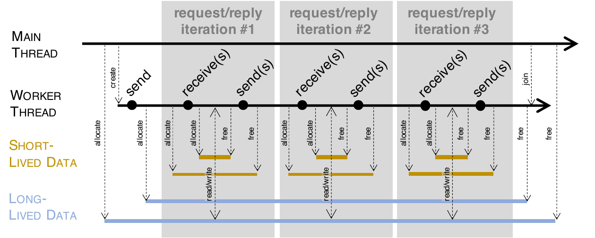
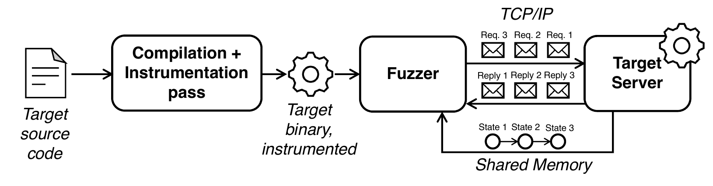
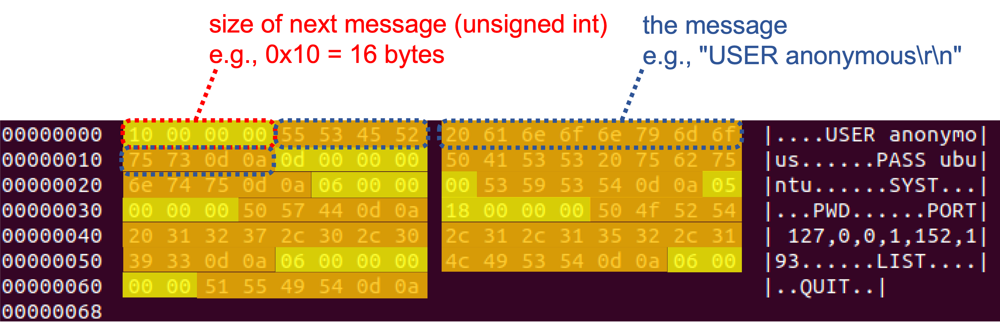

# StateAFL: A Coverage-Driven (Greybox) Fuzzer for Stateful Network Protocols
StateAFL is a fuzzer designed for network servers. It extends the original idea of the AFL fuzzer, which automatically evolves fuzz inputs to maximize code coverage. In addition to code coverage, StateAFL seeks to maximize protocol state coverage.

The aim of this tool is to contribute towards a completely-automated solution for stateful protocol fuzzing (similarly to what AFL was able to achieve for stateless programs) and to promote a wider application of fuzzing in real-world systems. The fuzzer does not require developers to implement custom message parsers for the protocol under test.

StateAFL automatically infers the current protocol state of the server. At compile-time, it instruments the target server with probes on memory allocations and network I/O operations. At run-time, it takes snapshots of long-lived data within process memory for each protocol iteration (see figure), and it applies fuzzy hashing to map the in-memory state to a unique protocol state.






More information about the internals of StateAFL is available in the following [research paper](https://arxiv.org/pdf/2110.06253.pdf).

StateAFL has been implemented on top of the codebase of [AFL](http://lcamtuf.coredump.cx/afl/) and [AFLnet](https://github.com/aflnet/aflnet). To fuzz a server, it should be compiled using the `afl-clang-fast` tool in this project, to perform a compiler pass for instrumenting the target.

# Licences

StateAFL is licensed under [Apache License, Version 2.0](https://www.apache.org/licenses/LICENSE-2.0).

StateAFL extends [AFLnet](https://github.com/aflnet/aflnet), written and maintained by Van-Thuan Pham <<thuan.pham@unimelb.edu.au>>, and [American Fuzzy Lop](http://lcamtuf.coredump.cx/afl/) written and maintained by Michał Zalewski <<lcamtuf@google.com>>. For details about these fuzzers, we refer to [README-AFLnet.md](README-AFLnet.md) and [README-AFL.md](README-AFL.md).

StateAFL uses the [Trend Micro Locality Sensitive Hash (TLSH) library](https://github.com/trendmicro/tlsh/) and the [MVPTree C library](https://github.com/michaelmior/mvptree/) for fuzzy hashing and for nearest neighbor search. StateAFL uses the [Containers library](https://github.com/bkthomps/Containers) for map, queue, and set data structures. StateAFL uses an [open-source implementation of memcpy from the XNU project](https://opensource.apple.com/source/xnu/xnu-2050.7.9/libsyscall/wrappers/memcpy.c) to override the ASAN's memcpy interceptor.

* **AFL**: Copyright 2013, 2014, 2015, 2016 Google Inc. All rights reserved. Released under terms and conditions of [Apache License, Version 2.0](https://www.apache.org/licenses/LICENSE-2.0).

* **TLSH**: Copyright 2013 Trend Micro Incorporated. Released under terms and conditions of [Apache License, Version 2.0](https://www.apache.org/licenses/LICENSE-2.0).

* **MVPTree C library**: Copyright 2008-2009 by D. Grant Starkweather. Released under terms and conditions of [GNU Public License, Version 3.0](https://www.gnu.org/licenses/gpl-3.0.txt).

* **Containers library**: Copyright (c) 2017-2020 Bailey Thompson. Released under terms and conditions of [MIT License](https://opensource.org/licenses/MIT).

* **memcpy**: Copyright (c) 1990, 1993 The Regents of the University of California. This code is derived from software contributed to Berkeley by Chris Torek. Released under terms and conditions of [BSD License](https://opensource.org/licenses/BSD-3-Clause).


# ProFuzzBench

If you want to run some experiments quickly, please take a look at [ProFuzzBench](https://github.com/profuzzbench/profuzzbench). ProFuzzBench includes a suite of representative open-source network servers for popular protocols (e.g., TLS, SSH, SMTP, FTP, SIP), and tools to automate experimentation. StateAFL has been integrated into that benchmark.


# Installation (Tested on Ubuntu 18.04 & 16.04 64-bit)

## Prerequisites

```bash
# Install clang (required by afl-clang-fast)
sudo apt-get install clang
# Install graphviz development
sudo apt-get install graphviz-dev
```

## StateAFL

Download StateAFL and compile it. We have tested StateAFL on Ubuntu 18.04 and Ubuntu 16.04 64-bit and it would also work on all environments that support the vanilla AFL and [graphviz](https://graphviz.org).

```bash
# First, clone this StateAFL repository to a folder named stateafl
git clone <links to the repository> stateafl
# Then move to the source code folder
cd stateafl
make clean all
cd llvm_mode
# The following make command may not work if llvm-config cannot be found
# To fix this issue, just set the LLVM_CONFIG env. variable to the specific llvm-config version on your machine
# On Ubuntu 18.04, it could be llvm-config-6.0 if you have installed clang using apt-get
make
# Move to StateAFL's parent folder
cd ../..
export STATEAFL=$(pwd)/stateafl
```

## Setup PATH environment variables

```bash
export PATH=$STATEAFL:$PATH
export AFL_PATH=$STATEAFL
```

# Usage

StateAFL can be run using the same command line options of AFL and AFLNet (except for protocol specification). Run ```afl-fuzz --help``` to see all options. Please also see [README-AFLnet.md](README-AFLnet.md) for more information.

- ***-i folder***: folder with input files, in replayable format (see below)

- ***-N netinfo***: server information (e.g., tcp://127.0.0.1/8554)

- ***-P protocol***: (optional, for cross-checking protocol state machine against AFLNet) application protocol to be tested (e.g., RTSP, FTP, DTLS12, DNS, DICOM, SMTP, SSH, TLS, DAAP-HTTP, SIP)

- ***-D usec***: (optional) waiting time (in microseconds) for the server to complete its initialization 

- ***-K*** : (optional) send SIGTERM signal to gracefully terminate the server after consuming all request messages

- ***-E*** : (optional) enable state aware mode

- ***-R*** : (optional) enable region-level mutation operators

- ***-F*** : (optional) enable false negative reduction mode

- ***-c script*** : (optional) name or full path to a script for server cleanup

- ***-q algo***: (optional) state selection algorithm (e.g., 1. RANDOM_SELECTION, 2. ROUND_ROBIN, 3. FAVOR)

- ***-s algo***: (optional) seed selection algorithm (e.g., 1. RANDOM_SELECTION, 2. ROUND_ROBIN, 3. FAVOR)

- ***-u path to "vanilla" executable***: (optional) if this is provided, StateAFL uses two forkservers, for better performance: one for profiling the code coverage (by running an input on the target executable indicated in "-u", which can be the same executable that would be used in AFLNet/AFLnwe); and another for profiling the protocol state (by running the executable compiled with StateAFL's afl-clang-fast)

- ***-U path to folder***: (optional) working directory where to run the "vanilla" executable (see option -u)


Example command: 
```bash
afl-fuzz -d -i in -o out -N <server info> -x <dictionary file> -D 10000 -q 3 -s 3 -E -K -R <executable binary and its arguments (e.g., port number)>
```

# Preparing the seed inputs

StateAFL takes in input seed files in "replayable" format. It is a simple format also used in AFLNet for replaying inputs (i.e., the ones saves in `replayable-queue` and `replayable-crashes` within the output folder), using the command `aflnet-replay`. The format alternates the size of a message (4 bytes, unsigned int) and the contents of that message.



You can automatically generate seed files from PCAP traces, as follows:

```bash
$ python3 convert-pcap-replay-format.py --input ftp_requests_full_normal.pcap --server-port 2200 --output ftp_requests_full_normal.replay

Writing 13 bytes...
Writing 13 bytes...
Writing 6 bytes...
Writing 5 bytes...
Writing 24 bytes...
Writing 6 bytes...
Writing 10 bytes...
Writing 6 bytes...
Converted PCAP saved to ftp_requests_full_normal.replay

$ hexdump -C ftp_requests_full_normal.replay

00000000  0d 00 00 00 55 53 45 52  20 75 62 75 6e 74 75 0d  |....USER ubuntu.|
00000010  0a 0d 00 00 00 50 41 53  53 20 75 62 75 6e 74 75  |.....PASS ubuntu|
00000020  0d 0a 06 00 00 00 53 59  53 54 0d 0a 05 00 00 00  |......SYST......|
00000030  50 57 44 0d 0a 18 00 00  00 50 4f 52 54 20 31 32  |PWD......PORT 12|
00000040  37 2c 30 2c 30 2c 31 2c  31 33 32 2c 32 30 39 0d  |7,0,0,1,132,209.|
00000050  0a 06 00 00 00 4c 49 53  54 0d 0a 0a 00 00 00 4d  |.....LIST......M|
00000060  4b 44 20 74 65 73 74 0d  0a 06 00 00 00 51 55 49  |KD test......QUI|
00000070  54 0d 0a                                          |T..|
00000073
```

The PCAP file should only contain one message flow between the server and a client. Both TCP and UDP are supported. If the PCAP contains multiple message flows, you can use the options `--client-port` and `--ignore-multiple-clients` to pick a specific flow and ignore the others. To run the conversion script, you need to install the [pyshark](https://github.com/KimiNewt/pyshark) Python package, and the [tshark](https://tshark.dev/) tool. It is **not required** that the protocol under test can be parsed by tshark. The script only extracts the raw payload from TCP or UDP traffic.

# Demo

The following demo shows how to use StateAFL on an FTP server. It starts from collecting the PCAP from a simple client-server session. The PCAP is then converted in "replayable" format, and seeded to StateAFL. StateAFL incrementally builds a Finite State Machine of the protocol from the in-memory states of the FTP server.

For more information on automating fuzzing experiments, see the [ProFuzzBench project](https://github.com/profuzzbench/profuzzbench).

<p align="center"></p>

## Demo transcript

Environment variables:
```
WORKDIR=/home/ubuntu/experiments
STATEAFL=/home/ubuntu/stateafl
```

To collect a PCAP with tcpdump:
```
$ sudo tcpdump -i lo -w pcaps/ftp.pcap port 2200
```

To run the LightFTP server:
```
$ ./fftp fftp.conf 2200
```

To run the FTP client:
```
$ ftp localhost 2200
Logged-in as "ubuntu", pass "ubuntu"
pwd
mkdir TEST
cd TEST
pwd
quit
```

To convert the PCAP trace:
```
$ python3 $STATEAFL/convert-pcap-replay-format.py --input $WORKDIR/pcaps/ftp.pcap --server-port 2200 --output $WORKDIR/in-ftp-replay/ftp.replay
```

To fuzz the FTP server:
```
$ make clean
$ CC=${STATEAFL}/afl-clang-fast make clean all -j3

$ ${STATEAFL}/afl-fuzz -d -i ${WORKDIR}/in-ftp-replay -x ${WORKDIR}/ftp.dict -o ${WORKDIR}/output -N tcp://127.0.0.1/2200 -D 10000 -q 3 -s 3 -E -K -m none -t 5000 -c ${WORKDIR}/ftpclean -u ${WORKDIR}/LightFTP/Source/Release/fftp -- ./fftp fftp.conf 2200
```

To plot (on the terminal) the protocol state machine:
```
$ watch -n 1 'cat $WORKDIR/output/ipsm.dot | graph-easy --from=dot --as_ascii 2>/dev/null'
```

